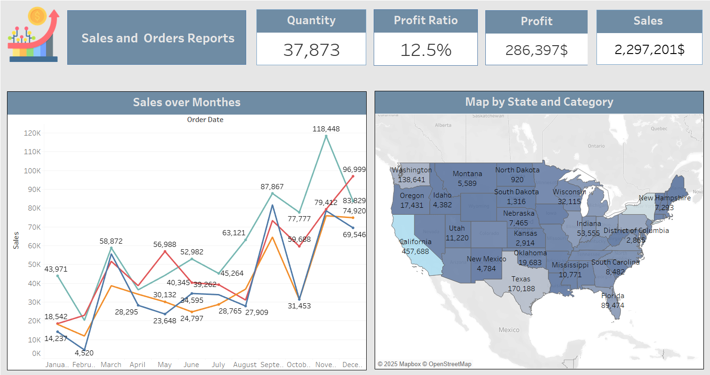
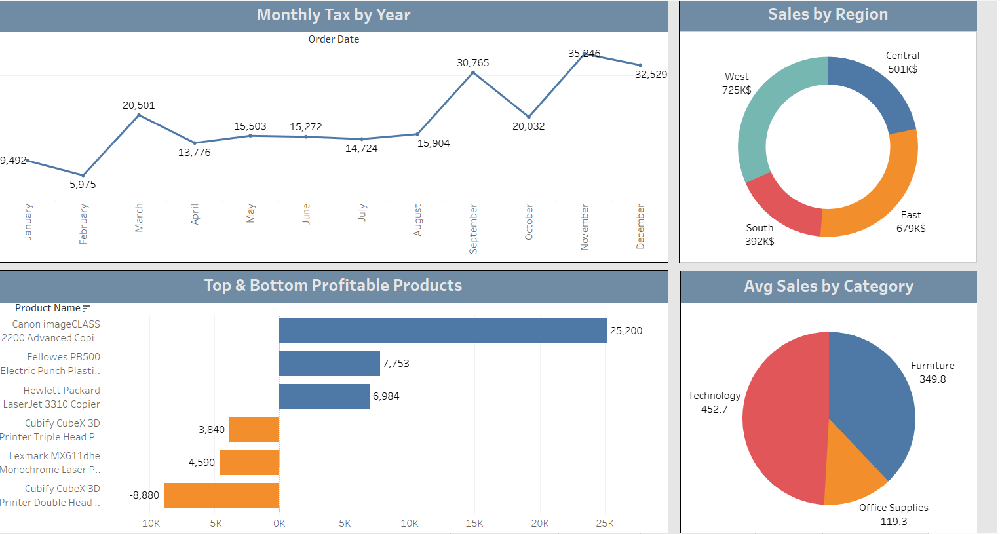

# Tableau Project - Sample Superstore Dashboard

## 📊 Project Overview
This Tableau project is based on the **Sample Superstore** dataset.  
The goal is to analyze sales, profit, and customer insights through interactive dashboards.

## 🛠 Key Visualizations
1. **KPI Cards**: Total Sales, Total Profit, Profit Ratio, and Quantity.  
2. **Sales Over Months**: Trend of sales performance across time.  
3. **Top & Bottom Products**: Highlighting the top 3 and bottom 3 profitable products.  
4. **Geographical Analysis**: Map showing sales and profit by state and category.  
5. **Category Parameter**: Switch between Sales and Profit for each category.  
6. **Pie Chart**: Average sales distribution across product categories.  
7. **Donut Chart**: Total sales in $K with % contribution by region.  
8. **Tax Analysis**: Monthly tax (10% of sales) with year filter.  
9. **Interactive Dashboard**: Combines all visuals into a clean, user-friendly design.  

## 📷 Screenshots
### Dashboard Views
  
  

## 🔗 Live Version
You can view the interactive dashboard on Tableau Public here:  
👉 [Sample Superstore Dashboard](https://public.tableau.com/app/profile/nahla.hamed)
